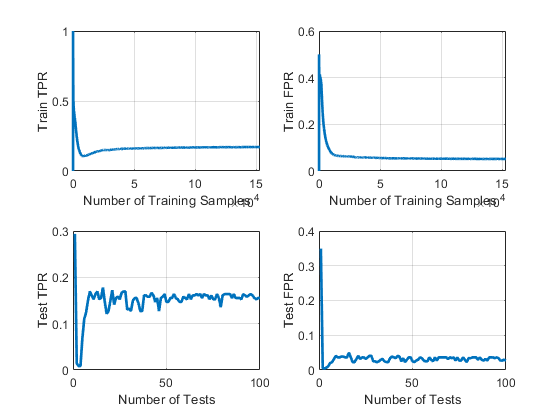
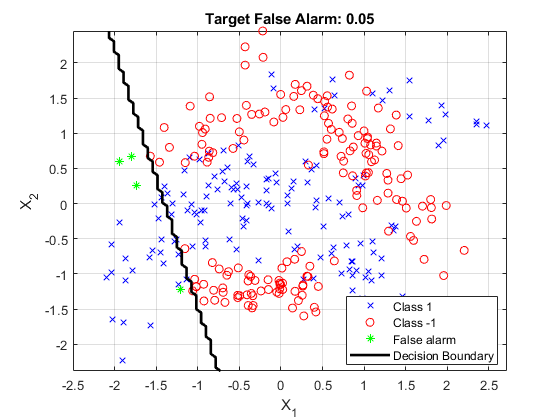
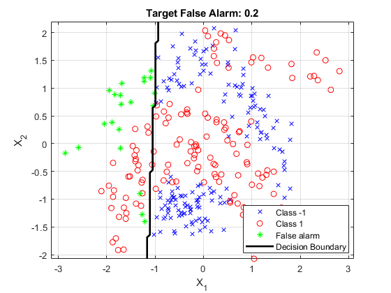

# Online Linear Neyman-Pearson Classification
This is the repository for Online Neyman Pearson (NP) Classifier described in [1]: https://dl.acm.org/doi/pdf/10.1145/1961189.1961200?casa_token=wkfMmSngkWAAAAAA:WwjFomI3GmEUVX8uYJ03C4252X6xGW6wB0tCFBkVk6X_aS7CZXUgiEE4RS3BSMiwWiShPjfNsxprTAk. 
The only difference within the implementation is is the estimation of FPR of the perceptron in the training phase. Similar approach is also used in [2]. 

# Running The Code
* "main." is the main function for running OLNP.
* OLNP is an NP classifier therefore it is optimized for a selected false alarm rate.
* List of different false alarms are given in the main function. Using can select any of these false alarms as target false alarm by changing the target false alarm index.
* Once the code is completed, Training and testing phases related graphs are generated.
* Selected hyperparameters and generated outputs are saved under output.
* Note that there should be additional folder with the same name as your input data file for saving the output. (e.g banana.mat, ./output/banana.mat)

# Hyperparameter Tuning
* "single_experiment.m" file optimizes model for a given set of hyperparameter set and target false alarm.
* Hyperparameter space is defined in single_experiment.m, user can increase the number of parameters for better tuning.
* If the model is already optimized (optimum parameters are saved and available under output folder), model will not tune its parameters and continue on testing.

# Repetitive Results
* OLNP is an online algorithm. Performance of the model is affected by the streaming order of the data. Therefore, in order to show significance of our experiements, we repeat tham MC times.
* MC is available in main function and stands for Monte Carlo repetition.
* The latest run in the main function does not contribute to the saved results. That computation is only for generating the graphs.

# Graphs
* Last stand alone single_experiment.m run in main.m is to generate output figures.
* There are 4 different graphs.
* These graphs correspond to transient behaviour of the model during training.
* Graphs of the 4 different arrays are shown below.
 

Top and bottom figures are related to train and test, respectively. The number of samples in training is related to the augmentation (explained in model parameters). 
In current case, the number of training samples is ~150k. Similarly, for test figures, there are 100 data points, where each point is an individual test of the existing 
model at different stages of the training. Please refer to [2] for more detailed explanation. 

# Running the Model with a new data set
* Make sure downloaded data has the same fields with ./data/banana.mat
* Make sure the downloaded data is located under the data folder.
* Update the pipeline parameter showing the directory for the input data
* Include additional hyperparameters for better performance
* Create corresponding folder under output/.

# Expected Decision Boundaries
When input data is 2D, it is possible to visualize decision boundaries. I included 2 decision boundaries for target false alarms 0.05 and 0.2. 

Thanks!
Basarbatu Can

# References
[1] Gasso, Gilles, et al. "Batch and online learning algorithms for nonconvex Neyman-Pearson classification." ACM transactions on intelligent systems and technology (TIST) 2.3 (2011): 1-19.  
[2] Can, Basarbatu, and Huseyin Ozkan. "A Neural Network Approach for Online Nonlinear Neyman-Pearson Classification." IEEE Access 8 (2020): 210234-210250.